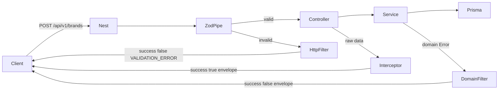

# Controllers + Zod + /api/v1 + shared response shape for catalog

## Goal

Expose brands, categories, and products under **`/api/v1`**, validate with existing Zod DTOs, and return the **same success and error envelope** from every endpoint. Keep naive: pipe + interceptor + filters + controllers; no Swagger, no auth.

## 1. Global prefix

In [apps/catalog-service/src/main.ts](apps/catalog-service/src/main.ts):

```ts
app.setGlobalPrefix('api/v1');
```

Paths: `/api/v1/brands`, `/api/v1/categories`, `/api/v1/products`.

## 2. Shared API envelope (success and error)

One shape for **all** catalog endpoints. Put helpers in the catalog app under `common/api/`:

- [apps/catalog-service/src/common/api/api-response.ts](apps/catalog-service/src/common/api/api-response.ts) — types + helpers
- [apps/catalog-service/src/common/api/error-codes.ts](apps/catalog-service/src/common/api/error-codes.ts) — stable machine codes

### Success

```ts
type ApiSuccessResponse<T> = {
  success: true;
  data: T;
  meta?: {
    page: number;
    limit: number;
    total: number;
  };
};
```

Helpers:

- `ok(data)` → `{ success: true, data }`
- `okList(items, meta)` → `{ success: true, data: items, meta }` (list endpoints: brands/categories/products filter)

**Resource status codes (HTTP remains semantic):**

| Method | Route | HTTP | `data` |
|--------|-------|------|--------|
| `POST` | `/` | 201 | created entity |
| `GET` | `/` | 200 | array + `meta` `{ page, limit, total }` |
| `GET` | `/:id` | 200 | entity |
| `PATCH` | `/:id` | 200 | updated entity |
| `DELETE` | `/:id` | 200 | `null` (envelope always present; avoid 204 empty body) |

### Error

```ts
type ApiErrorResponse = {
  success: false;
  error: {
    code: string;       // stable machine code, e.g. BRAND_NOT_FOUND
    message: string;    // human-readable
    details?: unknown;  // validation issues, optional extras
  };
};
```

**HTTP status still encodes class of failure; body always `success: false`.**

| Situation | HTTP | Example `error.code` |
|-----------|------|----------------------|
| Zod validation failure | 400 | `VALIDATION_ERROR` (`details` = Zod issues array) |
| Not found / missing parent / product ref | 404 | `BRAND_NOT_FOUND`, `CATEGORY_NOT_FOUND`, `PRODUCT_NOT_FOUND`, `PARENT_BRAND_NOT_FOUND`, `PRODUCT_REFERENCE_NOT_FOUND` |
| Already exists | 409 | `BRAND_ALREADY_EXISTS`, `CATEGORY_ALREADY_EXISTS` |
| In use | 409 | `BRAND_IN_USE`, `CATEGORY_IN_USE` |
| Unexpected | 500 | `INTERNAL_ERROR` |

Domain filter maps each domain error class to a fixed `{ status, code, message }`. Do not expose stack traces in bodies.

### How envelope is applied (controllers stay thin)

1. **`ApiResponseInterceptor`** ([apps/catalog-service/src/common/interceptors/api-response.interceptor.ts](apps/catalog-service/src/common/interceptors/api-response.interceptor.ts)): wrap controller return values that are not already `{ success: ... }`. Convention for list: controller returns `{ items, total, page, limit }` and interceptor turns that into `okList` + `meta`; scalars/entities → `ok(data)`; delete returns `null` → `ok(null)`.

2. **`ZodValidationPipe`**: on failure throw Nest `BadRequestException` with a structured body the error filter normalizes to `VALIDATION_ERROR`.

3. **`DomainExceptionFilter`**: maps known domain errors → envelope 404/409.

4. **`HttpExceptionFilter`** (or same filter handling Nest `HttpException`): maps validation/other Nest HTTP exceptions into the **same** error envelope so clients never see Nest’s default `{ statusCode, message }` shape.

Register interceptor + filters globally in `main.ts`.

Example success (list):

```json
{
  "success": true,
  "data": [{ "id": "...", "name": "samsung" }],
  "meta": { "page": 1, "limit": 10, "total": 1 }
}
```

Example error (validation):

```json
{
  "success": false,
  "error": {
    "code": "VALIDATION_ERROR",
    "message": "Validation failed",
    "details": [{ "path": ["name"], "message": "Name is required" }]
  }
}
```

## 3. Shared `ZodValidationPipe`

Under `@app/utils`:

- [utils/pipes/zod-validation.pipe.ts](utils/pipes/zod-validation.pipe.ts) — `schema.safeParse(value)`; on failure `BadRequestException` with Zod issues; return parsed data.
- Export via [utils/pipes/index.ts](utils/pipes/index.ts).

Usage:

```ts
@Body(new ZodValidationPipe(createBrandDto)) body: CreateBrandDto
@Query(new ZodValidationPipe(brandSearchFilters)) filters: BrandSearchFilters
@Param(new ZodValidationPipe(deleteBrandDto)) params: DeleteBrandDto
```

## 4. Adjust Zod DTOs for HTTP

Query strings are strings. Update filter schemas:

- [brands.dto.ts](apps/catalog-service/src/brands/dto/brands.dto.ts)
- [categories.dto.ts](apps/catalog-service/src/categories/dto/categories.dto.ts)
- [products.dto.ts](apps/catalog-service/src/products/dto/products.dto.ts)

Use **`z.coerce.number()`** for `page` / `limit` (positive ints, optional). Body create/update keep JSON numbers as-is.

## 5. Controllers (one per module)

| Module | Path | File |
|--------|------|------|
| Brands | `brands` | `apps/catalog-service/src/brands/controllers/brands.controller.ts` |
| Categories | `categories` | `apps/catalog-service/src/categories/controllers/categories.controller.ts` |
| Products | `products` | `apps/catalog-service/src/products/controllers/products.controller.ts` |

**Routes per resource:** `POST /`, `GET /`, `GET /:id`, `PATCH /:id`, `DELETE /:id` (HTTP codes as in success table above).

- Brands/categories `update`: pass `body.name` into service `(id, name)`.
- Products `update`: pass full `UpdateProductDto`.
- List handlers return `{ items, total, page, limit }` for the interceptor (pull `page`/`limit` defaults from validated filters).

Register controllers on each feature module.

## 6. Flow



## 7. Verification

- Unit-test Zod pipe (valid / invalid).
- Unit-test envelope helpers (`ok` / `okList`) and domain filter mapping for one not-found + one already-exists case.
- `pnpm build:catalog` succeeds; service unit tests stay green.

Out of scope: full e2e against DB, OpenAPI, auth, Nest URI versioning decorator (prefix only).
