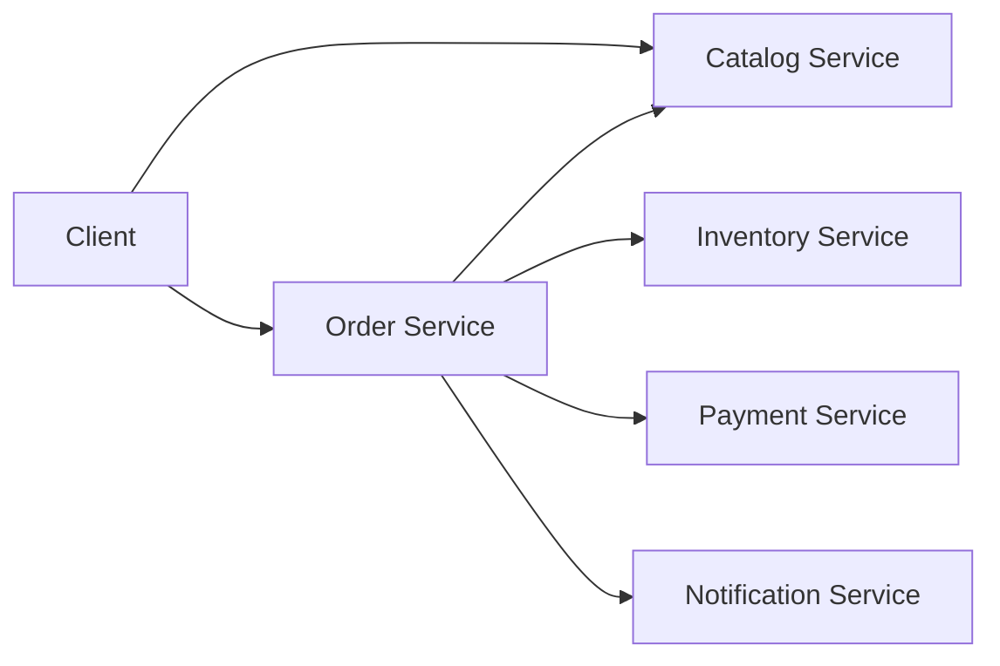
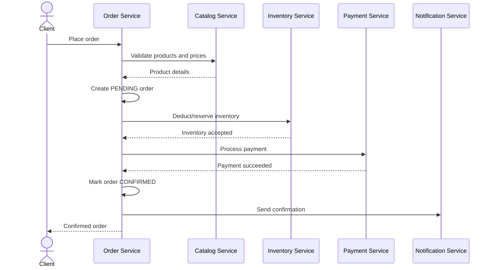

# Microservices Learning Project

## Purpose

This repository is a learning project that will evolve in small, observable steps. It starts with a simple synchronous microservice architecture and gradually introduces asynchronous messaging, reliability patterns, and distributed transaction patterns.

The goal is not to design the final system upfront. Each stage should remain runnable and demonstrate why the next architectural pattern is useful.

## Services

Each service owns its data and exposes an API. Services must not read or modify another service's database directly.

### Catalog Service

Owns product information used for browsing.

Initial capabilities:

- List brands
- List product categories
- List products
- Get a product by ID

Example data:

- Brand: ID and name
- Product category: ID and name
- Product: ID, SKU, name, description, price, brand ID, and category ID

The catalog describes products but does not own stock quantities.

### Inventory Service

Owns stock levels and inventory changes.

Initial capabilities:

- Get available quantity for a product
- Reserve or deduct inventory for an order
- Release or restore inventory when an order is cancelled or fails

Inventory operations should be idempotent by using the order ID as an operation reference. Stock must never become negative.

### Order Service

Owns the order lifecycle and coordinates the initial synchronous workflow.

Initial capabilities:

- Place an order
- Get an order by ID
- List orders
- Cancel an order

Initial order states:

- `PENDING`
- `CONFIRMED`
- `CANCELLED`
- `FAILED`

The Order Service is the initial workflow coordinator. This is intentional so that later stages can demonstrate the limitations of synchronous orchestration and the value of sagas.

### Payment Service

Owns payment attempts and their results.

Initial capabilities:

- Process a payment
- Get payment status
- Refund or void a payment when an order is cancelled

Payment operations should be idempotent. Repeating a request with the same order ID and idempotency key must not charge the customer twice.

Initial payment states:

- `PENDING`
- `SUCCEEDED`
- `FAILED`
- `REFUNDED`

The first implementation may use a fake payment processor so failure and retry scenarios can be tested safely.

### Notification Service

Owns notification records and delivery attempts.

Initial capabilities:

- Send an order confirmation
- Send an order cancellation update
- Send a payment update

The first implementation can write notifications to logs or store them for inspection instead of integrating with an external email or SMS provider.

## Initial Architecture: Synchronous HTTP

Clients communicate with the Order Service to place and cancel orders. Internal service communication initially uses synchronous HTTP/JSON.

This design is deliberately simple. It makes coupling, partial failures, retries, and latency visible before messaging patterns are introduced.

## Place Order Flow

The initial happy path is:

1. The client submits products, quantities, and payment details to the Order Service.
2. The Order Service validates product details and prices with the Catalog Service.
3. The Order Service creates a `PENDING` order.
4. The Order Service asks the Inventory Service to deduct or reserve stock.
5. The Order Service asks the Payment Service to process payment.
6. The Order Service marks the order `CONFIRMED`.
7. The Order Service asks the Notification Service to send an order confirmation.

If inventory is unavailable, the order becomes `FAILED` and payment is not attempted.

If payment fails after inventory was deducted, the Order Service asks the Inventory Service to restore it and marks the order `FAILED`.

Notification failure should not reverse a successful order. It is recorded and can be retried.

## Cancel Order Flow

Only an eligible order can be cancelled.

1. The client asks the Order Service to cancel an order.
2. The Order Service asks the Payment Service to refund or void a successful payment.
3. The Order Service asks the Inventory Service to restore stock.
4. The Order Service marks the order `CANCELLED`.
5. The Order Service asks the Notification Service to send a cancellation update.

The exact cancellation rules can evolve later, for example by preventing cancellation after fulfillment begins.

## Data Ownership

Each service will eventually have its own database or schema boundary:

| Service | Owned data |
| --- | --- |
| Catalog | Brands, categories, products, product prices |
| Inventory | Stock quantities, reservations, inventory movements |
| Order | Orders, order items, order status history |
| Payment | Payment attempts, payment status, refunds |
| Notification | Notification requests, delivery attempts, delivery status |

Orders must store a snapshot of product name, SKU, and price at purchase time. Historical orders must not change when the catalog changes.

Cross-service references use stable IDs, but there are no cross-service database foreign keys.

## Initial Reliability Rules

Even the synchronous version should establish a few important rules:

- Every request has a correlation ID for tracing across services.
- Mutating operations use idempotency keys.
- Network calls have explicit timeouts.
- Retries are bounded and only used for safe or idempotent operations.
- APIs return structured errors.
- Services expose health endpoints.
- Logs include service name, correlation ID, and relevant entity IDs.
- Tests cover both successful workflows and partial failures.

## Evolution Roadmap

The project should evolve one concept at a time. Each stage should document the problem it solves and retain tests that demonstrate the behavior.

### Stage 1: Synchronous Foundation

- Implement the five services with HTTP APIs
- Give every service clear data ownership
- Implement place-order and cancel-order workflows
- Add idempotency, timeouts, health checks, and integration tests
- Run services locally with containers

### Stage 2: Observe Synchronous Limitations

- Add distributed tracing and metrics
- Simulate slow and unavailable dependencies
- Add retries and circuit breakers
- Explore cascading failures and retry amplification

### Stage 3: Introduce Events

Introduce one broker such as NATS, RabbitMQ, or Kafka. Choose it when the learning goals for delivery, ordering, routing, and persistence are clear.

Candidate events:

- `OrderPlaced`
- `InventoryReserved`
- `InventoryRejected`
- `PaymentSucceeded`
- `PaymentFailed`
- `OrderConfirmed`
- `OrderCancelled`
- `InventoryReleased`
- `PaymentRefunded`

Move notifications to asynchronous event consumers first because notification delivery is not part of the order's critical path.

### Stage 4: Reliable Event Publication

- Add transactional outbox tables
- Publish outbox records through a relay
- Make consumers idempotent
- Handle duplicate delivery
- Add retries and dead-letter handling
- Define event versioning rules

The target is at-least-once delivery with safe duplicate processing, not an assumption of exactly-once delivery.

### Stage 5: Distributed Workflow with a Saga

- Replace the synchronous order coordinator with a saga
- First implement orchestration so the workflow remains easy to follow
- Add compensating actions for inventory release and payment refund
- Model intermediate states explicitly
- Later compare orchestration with choreography

### Stage 6: Advanced Experiments

- Compare NATS, RabbitMQ, and Kafka using the same business flow
- Add API gateway and service discovery if they solve a demonstrated need
- Explore schema registries and contract testing
- Add observability for message flows
- Explore event sourcing or CQRS only after their trade-offs are understood

## Learning Principles

- Start with the smallest working system.
- Introduce a pattern only after observing the problem it addresses.
- Prefer explicit state transitions over hidden side effects.
- Treat failures, retries, duplicates, and out-of-order messages as normal cases.
- Keep business behavior stable while changing communication patterns.
- Record architectural decisions and their trade-offs as the project evolves.

## Current Scope

The first milestone is the synchronous foundation. Broker selection, deployment topology, programming language, framework, and database choices are intentionally deferred until implementation begins.
